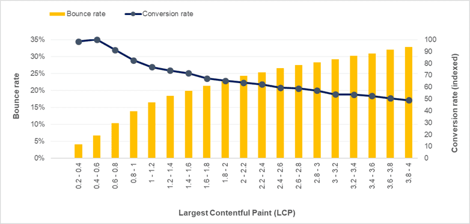
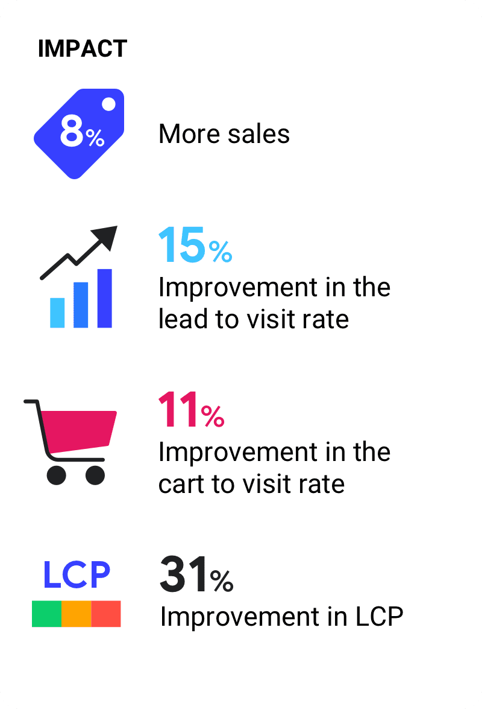
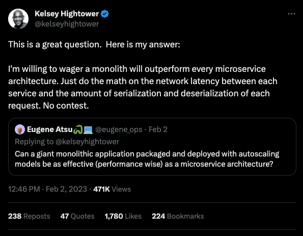
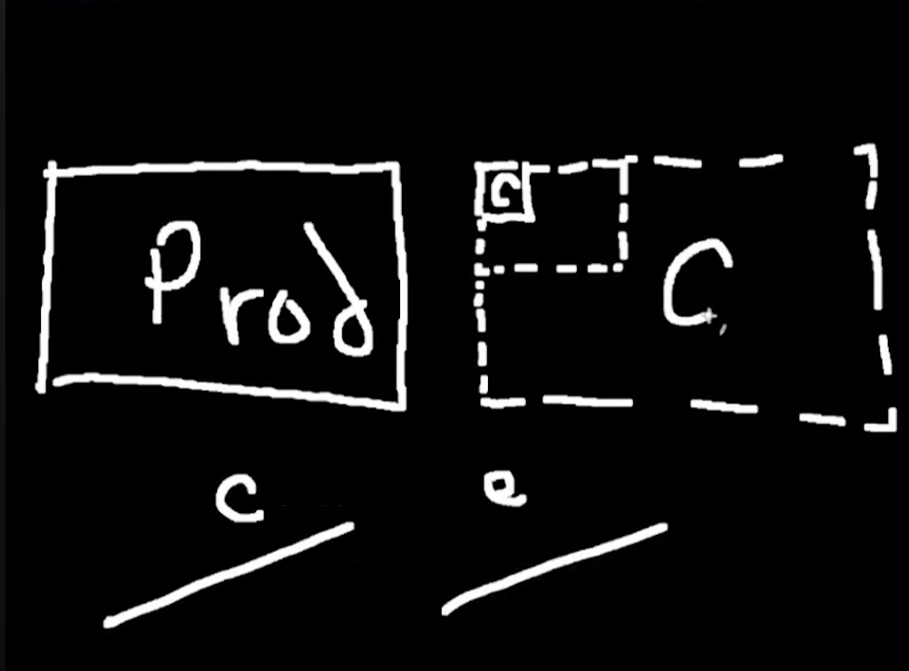

# Optimisation des performances web <!-- omit in toc -->

## Table des matières <!-- omit in toc -->

- [Introduction](#introduction)
  - [Quelles optimisations de quelles performances ?](#quelles-optimisations-de-quelles-performances-)
  - [Pourquoi optimiser](#pourquoi-optimiser)
  - [Les prérequis avant d'optimiser](#les-prérequis-avant-doptimiser)
- [Optimisation du frontend](#optimisation-du-frontend)
  - [Objectif SEO](#objectif-seo)
  - [Chargement des assets](#chargement-des-assets)
    - [Compression et format adapté](#compression-et-format-adapté)
    - [Preload](#preload)
    - [CDN](#cdn)
  - [Exemples et mises en pratique](#exemples-et-mises-en-pratique)
    - [Le cas de McMASTER-CARR](#le-cas-de-mcmaster-carr)
- [Optimisation de l'architecture et des serveurs](#optimisation-de-larchitecture-et-des-serveurs)
  - [L'impact de l'architecture backend](#limpact-de-larchitecture-backend)
    - [Le monolithe](#le-monolithe)
    - [Le micro service](#le-micro-service)
  - [Scaling](#scaling)
    - [Scaling vertical](#scaling-vertical)
    - [Scaling horizontal](#scaling-horizontal)
    - [Web scale, planet scale, ...](#web-scale-planet-scale-)
  - [L'impact de l'architecture frontend](#limpact-de-larchitecture-frontend)
    - [Le SSR](#le-ssr)
      - [Le SSG](#le-ssg)
    - [Le CSR](#le-csr)
    - [Le SPA](#le-spa)
  - [L'impact de l'infrastructure serveur](#limpact-de-linfrastructure-serveur)
    - [Le VPS](#le-vps)
    - [Le serverless](#le-serverless)
    - [Le edge](#le-edge)
- [Optimisation du backend](#optimisation-du-backend)
  - [Quel langage utiliser est le plus performant](#quel-langage-utiliser-est-le-plus-performant)
  - [L'impact des algorithmes](#limpact-des-algorithmes)
    - [Comment monitorer les fonctions](#comment-monitorer-les-fonctions)
  - [L'impact de la BDD](#limpact-de-la-bdd)
    - [SGBD ou SGBDR ?](#sgbd-ou-sgbdr-)
    - [GraphQL](#graphql)
    - [Améliorer les requêtes](#améliorer-les-requêtes)
  - [Le cache](#le-cache)

## Introduction

### Quelles optimisations de quelles performances ?

Optimisation :

- collection d'outils et de techniques pour répondre à un besoin, avec une approche quantitative
- les metrics sont au centre de la procédure
- on part d'un état donné et on tend vers un objectif réalisable

Performances :

- rapidité d'exécution
- fluidité
- utilisation de ressources (CPU, RAM, électricité, budget)
- mise à jour du programme (developer experience)

### Pourquoi optimiser

Une application lente va frustrer puis repousser les utilisateurs, donc diminuer les revenus :


source : https://web.dev/case-studies/renault


source : https://web.dev/case-studies/vodafone

Une application couteuse donne des excuses aux entreprises pour fermer des postes ou diminuer les salaires :
https://ludic.mataroa.blog/blog/i-accidentally-saved-half-a-million-dollars/

### Les prérequis avant d'optimiser

- avoir un besoin d'optimiser
- cibler un aspect précis de l'application
- avoir une baseline sur laquelle comparer et retenir des metrics simples
- mettre en place des outils pour quantifier les changements qu'ont eu les optimisations sur ces metrics

## Optimisation du frontend

### Objectif SEO

- Search Engine Optimization
- améliorer la structure et le contenu des pages web pour les placer en tête des résultats d'un moteur de recherche
- meilleur positionnement = augmentation des visites (= reach) + meilleure réputation auprès des visiteurs = plus de conversions

Les metrics à surveiller :

- score sur google pagespeed / lighthouse, ou score sur GTMetrix
- nombre de visites avec google analytics ou un équivalent open source (plausible, matomo)
- positionnement sur des mots clefs précis ou une recherche précise (semrush, google console)

Comment améliorer :

- https
- balises meta (keyword et description)
- titre de l'onglet
- ordre respecté des balises header
- alt text dans les balises img
- ajouter des backlinks
- ajouter un fichier sitemap.xml pour lister les pages et les organiser entre elles
- ajouter un fichier robots.txt pour indiquer aux crawlers des moteurs de recherche quelles pages indexer
- schema markup pour donner du contexte aux données de la page

### Chargement des assets

- les fichiers medias, CSS et JS sont les fichiers les plus longs à charger pour le navigateur

Les metrics à surveiller :

- les Core Web Vitals :
  - First Input Delay
    - le temps entre le début du chargement de la page et le moment où l'utilisateur peut intéragir avec
  - Largest Contentful Paint
    - le temps entre le début du chargement de la page et l'affichage du plus gros bloc de texte / média visible dans la fenêtre
    - remplace le First Meaningful Paint et le Speed Index
  - Cumulative Layout Shift
    - le score du nombre de décalage des éléments d'une page depuis son chargement jusqu'à sa fermeture

#### Compression et format adapté

- minifier les fichiers CSS et JS
  - retire tous les caractères inutiles (espaces, saut de ligne, indentation) pour réduire la taille des fichiers

- code splitting
  - séparer le code JS et CSS en plusieurs fichiers
    - ne pas charger un fichier gigantesque pour utiliser uniquement une fonction

- compresser les fichiers textes (JS, HTML et CSS) avec GZIP ou Brotli
  - pour réduire la taille des fichiers
  - ne pas utiliser sur les fichiers binaires (comme les images)
    - sauf les .svg

- utiliser un format adapté pour les images
  - svg pour les logos, les icones et toutes les autres images vectorielles
    - permet de s'adapter à toutes les résolutions sans changer de taille de fichier
  - webp pour le reste
    - meilleure compression que jpg
    - améliore le SEO
  - gif est aussi un format avec une bonne compression pour une image fixe
    - à ne pas utiliser pour une vidéo, préférer utiliser mp4
  - si le format n'est pas supporté par un navigateur, utiliser une image fallback :

```html
<picture>
    <source srcset="fichier.webp" type="image/webp" />
    
</picture>
```

- compresser les images
  - compresser un jpg à 70% est invisible à l'oeil nu
  - réduit la taille du fichier par 7
  - utiliser une API (kraken.io) ou des librairies (imagemagick, imagemin)
  
- réduire la dimension des images
  - pourquoi utiliser une image 4k alors que le container fait 500px ?

#### Preload

- `dns-prefetch`
  - lorsque le nom de domaine d'une ressource est connue, mais son URI peut varier
  - permet de faire une requête DNS en avance et de connaître l'adresse IP du serveur de la resource
  - permet de gagner entre 50 et 300ms
  - utile pour se connecter à un CDN ou à Google Fonts

- `preconnect`
  - comme `dns-prefetch` mais fait une connection conplète
  - fait gagner plus de temps mais demande plus de resources

- `prefetch`
  - permet de charger et mettre en cache une resource précise
  - s'active lorsque la balise qui l'utilise est visible sur la page
  - utile pour charger un bundle JS, une feuille CSS
  - la ressource doit être prioritaire pour l'affichage de la page

- `preload`
  - comme `prefetch`, mais pour des ressources non prioritaires pour l'affichage de la page

- `prerender`
  - charge en avance le contenu d'une page
  - permet de l'afficher instantanément une fois qu'on y navigue

#### CDN

- Content Delivery Network
- infrastructure qui met à disposition des serveurs dans le monde entier
- permet de stocker des fichiers statiques (images, fonts, css, js)
- lorsqu'une visite est faire sur un site, le serveur du CDN le plus proche lui fournit les fichiers demandés
- permet de réduire de 100ms environ une requête
- très efficace lorsque plusieurs requêtes sont faites d'affilées pour une page

Exemples de CDN :

- cloudflare
- fastly

### Exemples et mises en pratique

#### Le cas de McMASTER-CARR

- backend en .NET
- frontend en html et js maison

- pour les perfs
  - dns-prefetch pour les domaines des assets
  - preload des fonts, logos et autres images
  - utilisation d'un CDN pour stocker les assets...
  - ...et l'html du site
  - utilisation d'un service worker pour charger le site du cache (comme une PWA)
  - comportement :
    - la page est séparée en component
    - uniquement la partie centrale est mise à jour pendant la navigation
    - lorsqu'un lien est survolé, le contenu de la page et ses configs sont préchargés et mis en cache
    - lorsqu'il est cliqué, la partie centrale est mise à jour *puis* l'url
      - **SPA**

- pour le CLS
  - css critique en style avant l'html
  - taille fixe des images

## Optimisation de l'architecture et des serveurs

### L'impact de l'architecture backend


#### Le monolithe

Définition :

- toutes les fonctionnalités réunies dans une seule application, avec une seule base de données

Exemples d'utilisation :

- shopify (Ruby on Rails)
- whatsapp (Erlang)
- stackoverflow (C# et ASP.NET)

Avantages :

- tout est accessible à un seul endroit
  - facile à utiliser
  - facile à tester
  - facile à débugger
  - facile pour implémenter de nouvelles fonctionnalités
- scalable verticalement

Inconvénients :

- si un serveur est down, toutes les fonctionnalités sont downs
- mises à jour lentes
- déploit tout ou rien
- scale tout ou rien
- couplage fort des dépendances
  - au langage
  - au framework
  - aux designs patterns

#### Le micro service

Définition :

- ensemble de programmes répartis sur plusieurs noeuds pour atteindre un objectif commun
- 1 domaine applicatif = une application avec son API, sa logique métier et sa base de données
- dépendant d'un système pour faire communiquer les noeuds
  - par API HTTP, par RPC, par messaging

> Certains pourraient dire que le micro service est du rebranding des systèmes distribués.

Exemples d'implémentation :

- email
- internet
- systèmes d'aviation
- amazon, twitter, youtube, netflix

Avantages :

- permet de scaler horizontalement
- équipes de développement indépendantes

Inconvénients :

- définition floue
  - quand est-ce que c'est micro ?
  - c'est quoi un service ?
- complexité : [Problème des microservices](https://youtu.be/y8OnoxKotPQ)
- latence :



- absence de tooling
- destruction du DRY
  - il y a forcément des fonctionnalités communes aux services
  - faire un bundle
    - comment gérer les mises à jour ?
    - comment gérer les versions compatibles ?
    - comment gérer les fonctionnalités utiles pour services A et B mais inutiles pour X et Y ?
- destruction de la DX
- tests
  - de charge
  - d'intégration
    - qui maîtrise toute la chaîne pour maîtriser les tests d'intégration ?
  - passage sur de l'observabilité ?
    - canary



- coût énorme
  - en infrastructure
  - en personnes
- dette technique à moyen et long terme

> Certains pourraient faire un paralèlle avec la loi de Conway (la structure d'un système reflète la structure de l'organisation à son origine)

https://www.youtube.com/watch?v=LcJKxPXYudE&t=80s

### Scaling

#### Scaling vertical

- augmenter les performances d'une instance serveur
  - augmenter la puissance CPU , la RAM, l'espace disque, le type de stockage, l'interface réseau, ...
- difficilemnt rétrogradable

#### Scaling horizontal

- augmenter le nombre d'instances de serveurs pour répartir la charge
- facile à faire évoluer et adapter à la charge en temps réel
- coût adapté à la charge

#### Web scale, planet scale, ...


https://www.youtube.com/watch?v=b2F-DItXtZs

- architecture qui s'adapte automatiquement au nombre d'utiliseurs
  - les performances ne sont pas impactées
  - le nombre d'erreurs n'augmente pas
- utilisé par Facebook, Amazon, Google, ...

### L'impact de l'architecture frontend

#### Le SSR

Définition :

- server side rendering
  - le client fait une requête HTTP au serveur
  - le serveur construit la page et envoie l'HTML au client
  - le client télécharge des scripts JS et les exécute pour rendre la page dynamique
    - principe de l'hydration

> Certains pourraient dire que c'est exactement ce qu'on faisait en construisant des monolithes en PHP, Ruby on Rails, ...

Cas d'usages :

- blogs, e commerce

Avantages :

- le contenu est présent sur le serveur, donc crawlables et indexables
- temps de chargement rapide
  - chargement des données avant l'affichage
  - les serveur sont plus proches, moins d'aller-retours
  - plus facile pour mettre du cache
  - ne dépend pas de la capacité du client pour charger

Inconvénients :

- potentiels problèmes de shared state
- applications moins intéractives
- dépendant des performances du serveur
  - et de leur coût

##### Le SSG

Définition :

- static site generation
  - l'intégralité du site est généré sous forme de pages HTML prêtes à être utilisées

> Un site réalisé "à l'ancienne" avec des fichiers HTML, sans framework, est un SSG

Cas d'usages :

- blogs, site vitrine / landing page, portfolios

Avantages :

- tous ceux du SSR
- deployable sur CDN
  - donc coût d'hébergement réduits
  - chargement très rapide, peu importe la localisation des visiteur.ses
  - sécurité (pas de serveur)

Inconvénients :

- absence de logique côté serveur
  - pas de personnalisation de la page en fonction de l'utilisateur.ice
- chaque changement de contenu nécessite une nouvelle génération et un nouveau déploiement

#### Le CSR

Définition :

- client side rendering
  - le client télécharge des scripts JS
  - le JS exécuté construit la structure de la page depuis le client

Cas d'usages :

- dashboard, messagerie

Avantages :

- soulage le serveur
- peut tromper l'utilisateur.ice sur les performances en remplaçant des éléments au lieu de recharger la page
- grande intéractivité

Inconvénients :

- performances dépendantes de la bande passante du client et de son matériel
- difficultés pour implémenter du SEO efficacement
- difficultés pour mettre en place du cache
- doit constamment vérifier l'état des données (chargées ? nulles ?)

#### Le SPA

Définition :

- single page application
- une application qui ne recharge pas la page lors d'un changement de route
- traditionnellement une application CSR, mais peut être SSR

### L'impact de l'infrastructure serveur

#### Le VPS

Définition :

- virtual private server
- serveur sur lequel tout doit être configuré
- abonnement mensuel

Cas d'usages :

- tout ?

Avantages ... et inconvénients :

- prix fixe
- contrôle total sur la machine
  - gestion des ressources
  - gestion de la sécurité

#### Le serverless

Définition :

- serverless !== sans serveur
  - sans serveur *à gérer*
- déploiement chez un cloud provider (aws, azure, gcp, ...)
- souvent déploiement automatique OU automatisable facilement
- la machine est éteinte par défaut et s'allume lorsqu'il y a de la charge
  - scalable horizontalement
  - prix à l'utilisation, pas d'abonnement mensuel
    - souvent un free tier

Cas d'usages :

- scripts, cron
- prototypes, demo

Avantages :

- rapide à mettre en place
- couplé à un CDN pour les applications SSR

Inconvénients :

- doit être architecturé différemment
- management des coûts
- boîte noire
- walled garden
- cold start

#### Le edge

Définition :

- se base sur le serverless / cloud computing
- *CDN mais pour des exécutables*
- déploie le même script sur plusieurs serveurs dans le monde pour que le plus proche de l'utilisateur.ice soit utilisé

Avantages :

- pas de cold start

Inconvénients :

- on fait quoi de la DB ?

## Optimisation du backend

### Quel langage utiliser est le plus performant

https://byteofdev.com/posts/javascript-benchmarking-mess/

https://www.youtube.com/watch?v=RrHGX1wwSYM

### L'impact des algorithmes

#### Comment monitorer les fonctions

### L'impact de la BDD

#### SGBD ou SGBDR ?

#### GraphQL

#### Améliorer les requêtes

https://github.com/charles-001/dolphie

### Le cache
